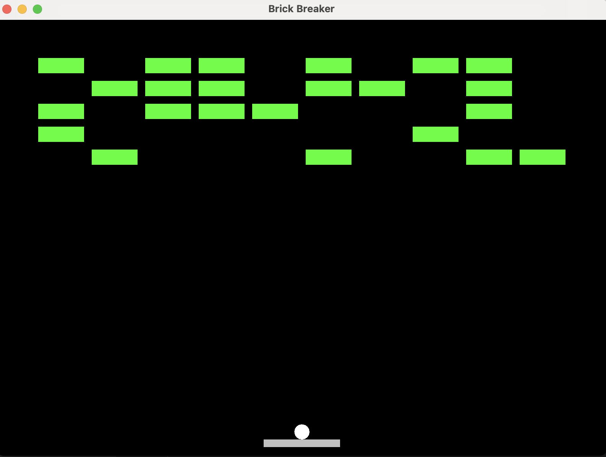

# Brick Breaker Game 

Welcome to Brick Breaker! This is a classic arcade-style game made with Java, where your goal is simple: 
break all the bricks on the screen by bouncing a ball off a paddle you control.

### What's Inside
Fun Gameplay: Control a paddle to keep the ball in play and smash through bricks.
Realistic Ball Movement: The ball reflects off walls, the paddle, and bricks at different angles to keep things interesting.
Brick Destruction: Each brick breaks when the ball hits it – keep going until all bricks are gone to win
Game Reset: Miss the ball? The game resets so you can try again.
Smooth Collision Detection: Handles bounces off walls, paddle, and bricks so the game feels natural and challenging.

[wiki](https://en.wikipedia.org/wiki/Brick_Breaker)

### Technology 
[KeyListener](https://www.geeksforgeeks.org/java-keylistener-in-awt/)