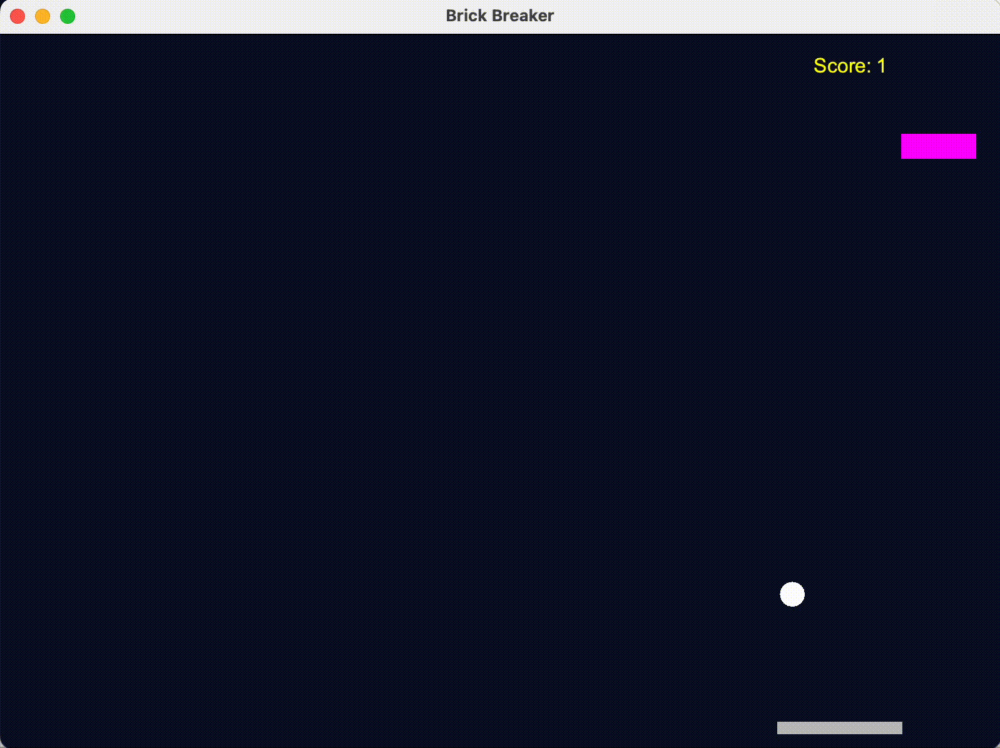
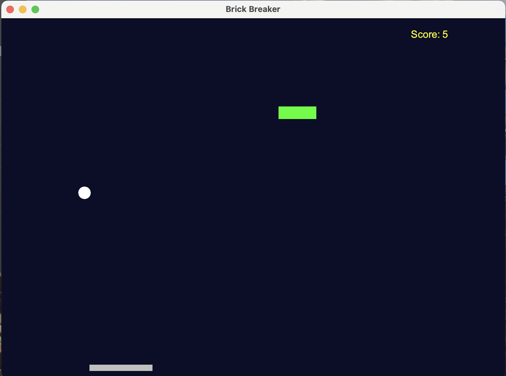

# Brick Breaker Game

Welcome to Brick Breaker!
This project takes the classic arcade-style game to the next level by integrating AI trained using a genetic algorithm.
While you can still play the game manually, the primary focus is on the AI's ability to learn how to control the paddle and aim at a brick.
### What's Inside
AI-Powered Gameplay: The AI controls the paddle, learning to keep the ball in play and aim effectively at a brick over time.
Genetic Algorithm for Training: The AI is trained using genetic algorithms, where a population of neural networks evolves through selection, crossover, and mutation.
Over generations, the AI becomes increasingly skilled at aiming and staying alive.

#### Training Process:

Population: 1000 AI agents per generation.

Selection: The top 10 agents with the highest scores are chosen as parents.

Crossover: Parent networks merge to create offspring.

Mutation: A small mutation rate ensures the AI explores new strategies.

[Brick Breaker Wikipedia](https://en.wikipedia.org/wiki/Brick_Breaker)

### Technology
[KeyListener](https://www.geeksforgeeks.org/java-keylistener-in-awt/)
* [Genetic Algorithm](https://en.wikipedia.org/wiki/Genetic_algorithm)
* [Neural Networks](https://github.com/kim-marcel/basic_neural_network)

### Contributors
* [SheyReiff](https://github.com/SheyReiff)
* [YaffaLevy](https://github.com/YaffaLevy)
*  [Lauren Lesser](https://github.com/Lauren34)